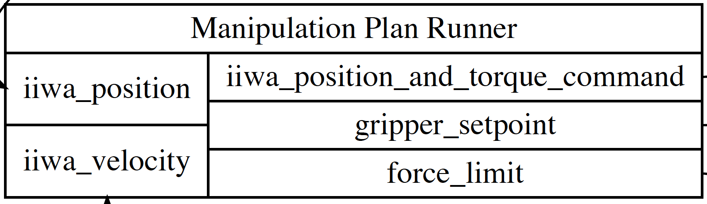
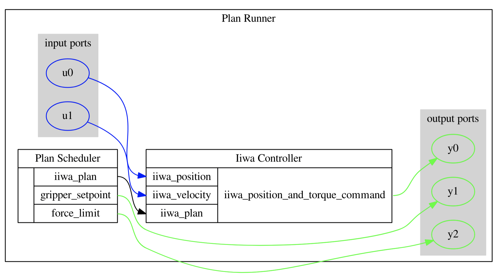

# Plan Runner

This module contains scripts that are useful for running simulations and sending commands to the real robot. 

## Files
- `manipulation_station_plan_runner.py`: `ManipStationPlanRunner` is a Drake `LeafSystem` (a system that cannot contain subsystems) that evaluates a list of `Plan`s and sends commands to the robot. 
- `manipulation_station_plan_runner_diagram.py`: the `Diagram` (a system that can contain subsystems) version of `ManipStationPlanRunner` (more details below). 
- `manipulation_station_simulator.py`: `ManipulationStationSimulator` constructs a Drake diagram system in which a `ManipStationPlanRunner` is connected to either a simulator ([`ManipulationStation`](https://drake.mit.edu/doxygen_cxx/classdrake_1_1examples_1_1manipulation__station_1_1_manipulation_station.html)) or an interface to the robot drivers ([`ManipulationStationHardwareInterface`](https://drake.mit.edu/doxygen_cxx/classdrake_1_1examples_1_1manipulation__station_1_1_manipulation_station_hardware_interface.html)). It can be used for simulating `Plan`s or executing `Plan`s on real hardware.
- `robot_plans.py` contains implementation of various plans. A plan is a class that contains function or data members that can be evaluated to generate position and/or torque command for a robot. 
- `open_left_door_plans.py` contains plan types specifically designed to open the left door of the cabinet in `ManipulationStation`. 
- `open_left_door.py` contains utility methods that facilitate opening the left door. 

## Running an example
`run_open_left_door.py` is an executable that runs different combinations of open-left-door procedures based on command line arguments. For example, 
```bash
$ python run_open_left_door.py --controller=Trajectory 
```
simulates opening the door by following trajectories, and
```bash
$ python run_open_left_door.py --controller=Impedance --hardware 
```
sends position and torque commands generated by the impedance controller to the real robot.

For more details, please refer to the definitions of command line arguments in `run_open_left_door.py`.

## Meshcat
Scripts running simulation will hang if no meshcat server is running. Run the following command in a terminal to open a meshcat server:
```bash
$ meshcat-server &
``` 

## Changing plans online
`ManipStationPlanRunner` is a `LeafSystem` that executes a given list of plans in sequence. Each plan is active for its `duration`, after which the next plan in the list becomes active. The limitation is that Plans cannot be changed after `ManipStationPlanRunner` starts running.

<p align="center" style="text-align: center">
   LeafSystem version of PlanRunner.<br/>
   </a>
</p>
 
`plan_runner.manipulation_station_plan_runner_diagram.CreateManipStationPlanRunnerDiagram` constructs the `Diagram` version of `ManipStationPlanRunner`. The `Diagram` system shares the same set of input and output ports as its `LeafSystem` counterpart, but it splits the `LeafSystem` into two subsystems: `PlanScheduler` and `IiwaController`. `PlanScheduler` determines which plan is active at a given time. `IiwaController` calculates `iiwa_position_command` and `iiwa_feedforward_torque_command` based on the currently active plan. 

<p align="center" style="text-align: center">
   Diagram version of PlanRunner. Each box is a LeafSystem.<br/>
   </a>
</p>

The provided `PlanScheduler` schedules plans in the same way as `ManipStationPlanRunner`. Customized scheduling logic, including creating new plans on the fly, can be implemented by writing a different `PlanScheduler`. For example, the following modifications are needed if it is desirable to create plans based on the current state of the robot:
- declaring additional input ports for robot states in the constructor of `PlanScheduler`,
- adding the creation of new plans to `PlanScheduler._GetCurrentPlan`.

To use the `Diagram` version of plan runner, set `is_plan_runner_diagram` to `True` when calling `ManipulationStationSimulator.RunSimulation(...)` or `ManipulationStationSimulator.RunRealRobot(...)`. See `run_left_open_door.py` for examples. 
